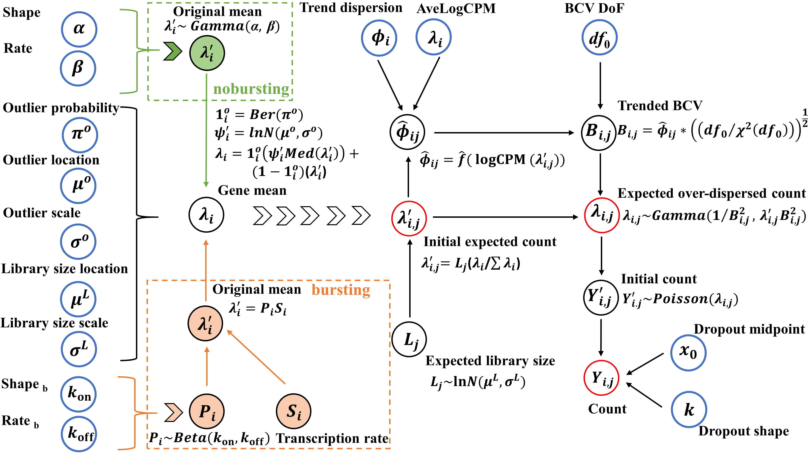

# 1. Introduction to SCRIP method

SCRIP proposed two frameworks based on Gamma-Poisson and Beta-Gamma-Poisson distribution for simulating scRNA-seq data. Both Gamma-Poisson and Beta-Gamma-Poisson distribution model the over dispersion of scRNA-seq data. Specifically, Beta-Gamma-Poisson model was used to model bursting effect. The dispersion was accurately simulated by fitting the mean-BCV dependency using generalized additive model (GAM). Other key characteristics of scRNA-seq data including library size, zero inflation and outliers were also modeled by SCRIP. With its flexible modeling, SCRIP enables various application for different experimental designs and goals including DE analysis, clustering analysis, trajectory-based analysis and bursting analysis 



# 2. Installation

```{r install-bioc, message=FALSE, warning = FALSE, eval=FALSE}
BiocManager::install("splatter")

library(devtools)
install_github("thecailab/SCRIP")
```

# 3.  Quick start

Assuming you already have a count matrix for scRNA-seq data, and you want to simulation data based on it. Only a few steps are needed to creat a simulation data using SCRIP.

A dataset from Xin data is used for example. 

```{r quickstart, message=FALSE, warning = FALSE}
library(splatter)
library(SCRIP)

dim(example)

params <- splatEstimate(example)

sim_trend <-  SCRIPsimu(data=example, params=params, mode="GP-trendedBCV")
sim_trend
```